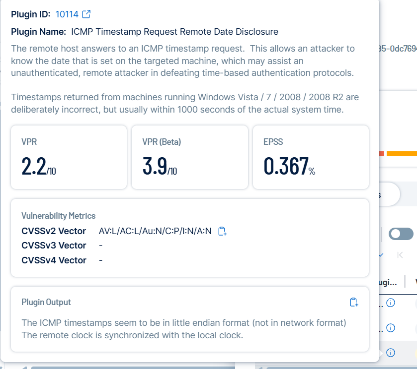

# ICMP Timestamp Request Remote Date Disclosure (Plugin ID: 10114)

## Before Remediation
- Vulnerability: ICMP Timestamp Request Remote Date Disclosure  
- Proof: Tenable scan shows plugin ID `10114` with CVSSv2 score `6.5`  
- Source: Tenable screenshot (see below)  

---

## Remediation
Disable ICMP timestamp responses by updating system/network settings:  
- **Windows**: Disable via registry or firewall (block ICMP timestamp).  
- **Linux**: `sysctl -w net.ipv4.icmp_echo_ignore_all=1` (or use iptables to drop timestamp requests).  

Verify the system no longer replies to ICMP timestamp requests and re-run a Tenable scan to confirm resolution.  

---

## After Remediation
- (Placeholder – will add screenshot once fixed and rescanned)  
- Confirm Tenable no longer reports plugin ID `10114`.  
- Proof: Updated Tenable scan screenshot (to be added).  

